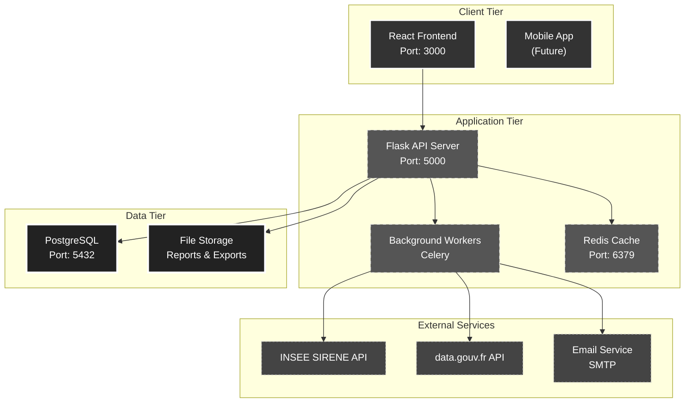
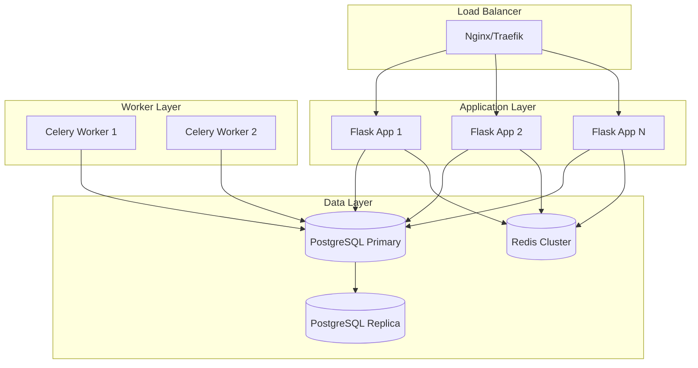
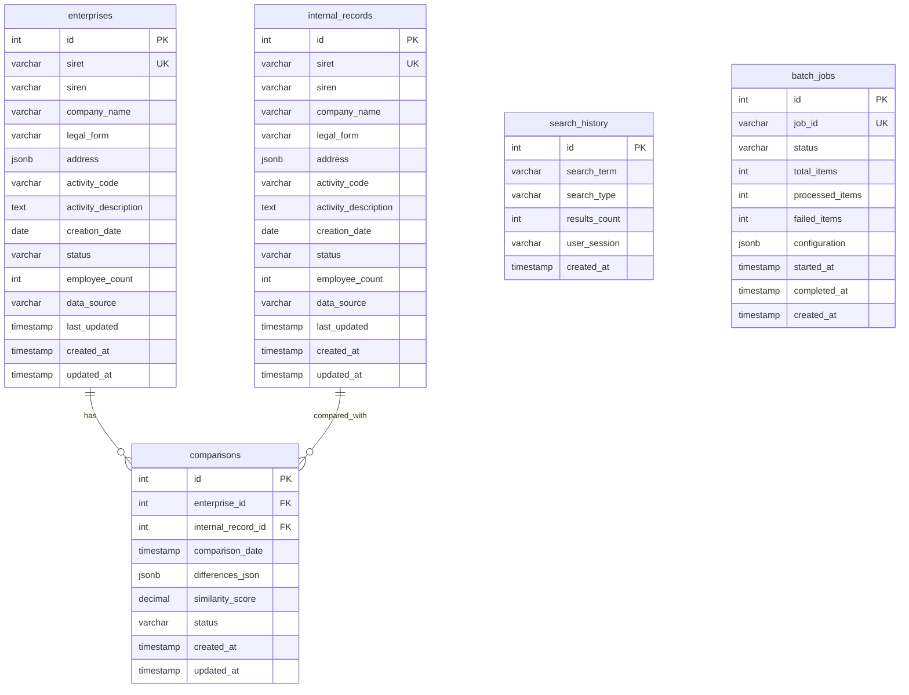
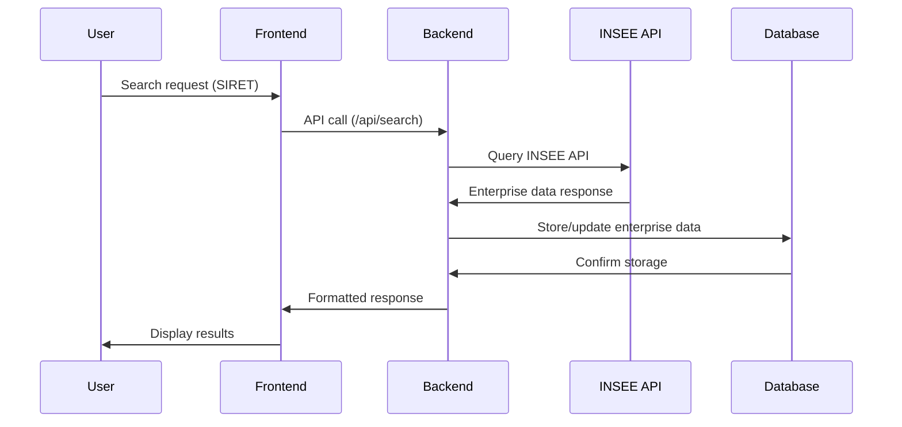
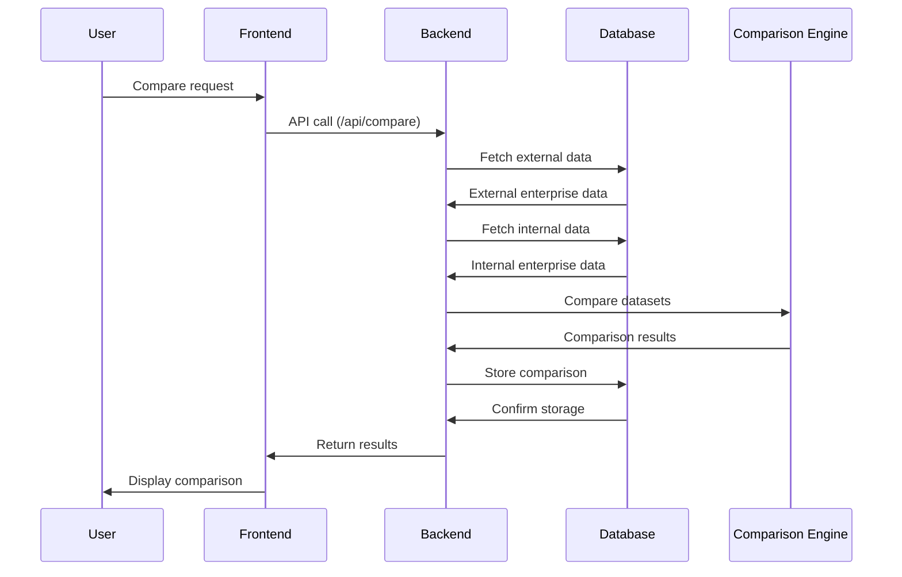
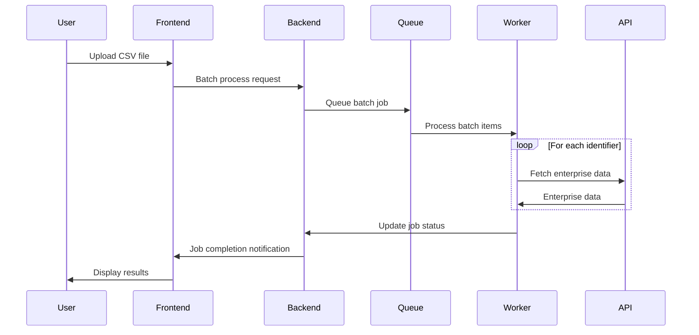

# 🏗️ Technical Architecture Documentation

## Enterprise Data Aggregation & Comparison Platform

## Table of Contents

1. [System Overview](#system-overview)
2. [Architecture Design](#architecture-design)
3. [User Stories & Requirements](#user-stories--requirements)
4. [Component Design](#component-design)
5. [Database Design](#database-design)
6. [API Specifications](#api-specifications)
7. [Sequence Diagrams](#sequence-diagrams)
8. [Implementation Plan](#implementation-plan)
9. [Development Guidelines](#development-guidelines)

## System Overview

The Enterprise Data Aggregation & Comparison Platform enables compliance officers and data analysts to validate French enterprise information by comparing external data sources (INSEE SIRENE) with internal records. The system provides automated data retrieval, intelligent comparison, and comprehensive reporting capabilities.

### Key Features

- 🔍 **Enterprise Search**: SIRET/SIREN number validation and lookup
- 📊 **Data Comparison**: Intelligent comparison with similarity scoring
- 📈 **Batch Processing**: Handle large datasets efficiently
- 📋 **Export Capabilities**: CSV and PDF report generation
- 🚀 **High Performance**: Optimized queries and caching
- 🔒 **Secure & Reliable**: Rate limiting, error handling, and data validation

## Architecture Design

### High-Level Architecture



### Technology Stack

| Component | Technology | Version | Justification |
|-----------|------------|---------|---------------|
| **Frontend** | React | 18+ | Component-based architecture, rich ecosystem, team expertise |
| **Backend** | Flask + Python | 3.9+ | Lightweight framework, excellent data processing (Pandas) |
| **Database** | PostgreSQL | 14+ | JSONB support, ACID compliance, full-text search |
| **Cache** | Redis | 7+ | Fast in-memory storage, session management |
| **Queue** | Celery + Redis | 5+ | Asynchronous processing for batch operations |
| **Containerization** | Docker | 20+ | Consistent environments, easy deployment |

### Deployment Architecture



## User Stories & Requirements

### Epic 1: Enterprise Search & Validation

#### Must Have (Priority 1)

**US-001: Basic Enterprise Search**
```gherkin
As a compliance officer
I want to search for French enterprises using SIRET/SIREN numbers
So that I can validate company information against official sources

Acceptance Criteria:
- Search accepts both SIRET (14 digits) and SIREN (9 digits)
- Input validation with clear error messages
- Results display within 3 seconds
- Fallback to secondary API if primary fails
```

**US-002: Data Comparison**
```gherkin
As a data analyst
I want to compare retrieved enterprise data with internal records
So that I can identify discrepancies and data quality issues

Acceptance Criteria:
- Side-by-side comparison view
- Highlighted differences with severity levels
- Similarity score calculation (0-100%)
- Field-level difference tracking
```

**US-003: Export Functionality**
```gherkin
As a compliance officer
I want to export comparison results to CSV and PDF formats
So that I can share findings with stakeholders and maintain audit trails

Acceptance Criteria:
- CSV export with all comparison data
- PDF report with formatted layout
- Batch export for multiple comparisons
- Download progress indication
```

#### Should Have (Priority 2)

**US-004: Batch Processing**
```gherkin
As a data analyst
I want to process multiple enterprise searches in batch
So that I can efficiently validate large datasets

Acceptance Criteria:
- Upload CSV file with identifiers
- Progress tracking for batch operations
- Email notification on completion
- Error handling for failed lookups
```

**US-005: Search History & Analytics**
```gherkin
As a user
I want to see my search history and usage statistics
So that I can track my validation activities and identify patterns

Acceptance Criteria:
- Recent searches list
- Usage statistics dashboard
- Saved search templates
- Performance metrics
```

## Component Design

### Backend Architecture

#### Core Models

```python
# models/enterprise.py
from dataclasses import dataclass, asdict
from datetime import datetime
from typing import Dict, List, Optional

@dataclass
class Enterprise:
    """Enterprise data model for external and internal records."""
    
    siret: str
    siren: str
    company_name: str
    legal_form: Optional[str] = None
    address: Optional[Dict] = None
    activity_code: Optional[str] = None
    activity_description: Optional[str] = None
    creation_date: Optional[datetime] = None
    status: Optional[str] = None
    employee_count: Optional[int] = None
    data_source: str = "UNKNOWN"
    last_updated: Optional[datetime] = None
    
    def to_dict(self) -> Dict:
        """Convert enterprise to dictionary."""
        return asdict(self)
    
    @classmethod
    def from_insee_data(cls, data: Dict) -> 'Enterprise':
        """Create Enterprise from INSEE API response."""
        establishment = data.get('etablissement', {})
        return cls(
            siret=establishment.get('siret'),
            siren=establishment.get('siren'),
            company_name=establishment.get('denominationUniteLegale'),
            legal_form=establishment.get('categorieJuridiqueUniteLegale'),
            address=cls._parse_address(establishment),
            activity_code=establishment.get('activitePrincipaleEtablissement'),
            creation_date=cls._parse_date(establishment.get('dateCreationEtablissement')),
            status=establishment.get('etatAdministratifEtablissement'),
            employee_count=establishment.get('trancheEffectifsEtablissement'),
            data_source="INSEE",
            last_updated=datetime.utcnow()
        )
    
    @staticmethod
    def _parse_address(establishment: Dict) -> Dict:
        """Parse address from establishment data."""
        return {
            'street': establishment.get('numeroVoieEtablissement', '') + ' ' + 
                     establishment.get('typeVoieEtablissement', '') + ' ' + 
                     establishment.get('libelleVoieEtablissement', ''),
            'city': establishment.get('libelleCommuneEtablissement'),
            'postal_code': establishment.get('codePostalEtablissement'),
            'country': 'France'
        }
```

#### Service Layer

```python
# services/data_aggregator.py
from typing import List, Optional, Dict
import asyncio
from .api_client import APIClient
from .comparison_engine import ComparisonEngine
from ..models.enterprise import Enterprise

class DataAggregator:
    """Main service for aggregating and processing enterprise data."""
    
    def __init__(self):
        self.api_client = APIClient()
        self.comparison_engine = ComparisonEngine()
    
    async def fetch_enterprise_data(self, identifier: str, id_type: str) -> Optional[Enterprise]:
        """Fetch enterprise data from external APIs with fallback."""
        try:
            # Try INSEE API first
            data = await self.api_client.get_enterprise(identifier, id_type)
            enterprise = Enterprise.from_insee_data(data)
            
            # Cache the result
            await self._cache_enterprise_data(enterprise)
            
            return enterprise
            
        except APIException as e:
            logger.warning(f"Primary API failed: {e}, trying fallback")
            return await self._try_fallback_api(identifier, id_type)
    
    async def process_batch(self, identifiers: List[str], id_type: str) -> Dict:
        """Process multiple enterprises in batch."""
        tasks = [
            self.fetch_enterprise_data(identifier, id_type) 
            for identifier in identifiers
        ]
        
        results = await asyncio.gather(*tasks, return_exceptions=True)
        
        return {
            'successful': [r for r in results if isinstance(r, Enterprise)],
            'failed': [r for r in results if isinstance(r, Exception)],
            'total': len(identifiers)
        }
    
    async def compare_with_internal(self, external_enterprise: Enterprise, internal_id: int) -> Dict:
        """Compare external data with internal record."""
        internal_enterprise = await self._get_internal_record(internal_id)
        if not internal_enterprise:
            raise ValueError(f"Internal record {internal_id} not found")
        
        comparison = self.comparison_engine.compare_enterprises(
            external_enterprise, internal_enterprise
        )
        
        # Store comparison result
        await self._store_comparison_result(comparison)
        
        return comparison.to_dict()
```

#### API Client with Circuit Breaker

```python
# services/api_client.py
import httpx
import asyncio
from typing import Dict, Optional
from circuitbreaker import circuit
from .rate_limiter import AsyncRateLimiter

class APIClient:
    """INSEE SIRENE API client with circuit breaker and retry logic."""
    
    def __init__(self):
        self.base_url = "https://api.insee.fr/entreprises/sirene/v3"
        self.fallback_url = "https://entreprise.data.gouv.fr/api/sirene/v3"
        self.client = httpx.AsyncClient(
            timeout=httpx.Timeout(30.0),
            limits=httpx.Limits(max_keepalive_connections=5, max_connections=10)
        )
        self.rate_limiter = AsyncRateLimiter(30, 60)  # 30 requests per minute
    
    @circuit(failure_threshold=5, recovery_timeout=60)
    async def get_enterprise(self, identifier: str, id_type: str) -> Dict:
        """Get enterprise data with circuit breaker protection."""
        await self.rate_limiter.acquire()
        
        endpoint = f"/{id_type}/{identifier}"
        headers = {
            "Authorization": f"Bearer {self.access_token}",
            "Accept": "application/json"
        }
        
        response = await self.client.get(
            f"{self.base_url}{endpoint}",
            headers=headers
        )
        
        if response.status_code == 404:
            raise EnterpriseNotFoundException(f"Enterprise {identifier} not found")
        elif response.status_code == 429:
            raise RateLimitExceededException("API rate limit exceeded")
        elif response.status_code >= 400:
            raise APIException(f"API error: {response.status_code}")
        
        return response.json()
```

### Frontend Architecture

#### Component Hierarchy

```
App
├── Layout
│   ├── Header
│   ├── Navigation
│   └── Footer
├── Pages
│   ├── SearchPage
│   │   ├── SearchForm
│   │   ├── SearchResults
│   │   └── RecentSearches
│   ├── ComparisonPage
│   │   ├── ComparisonView
│   │   ├── DifferenceHighlight
│   │   └── ExportButtons
│   ├── BatchPage
│   │   ├── FileUpload
│   │   ├── BatchProgress
│   │   └── BatchResults
│   └── DashboardPage
│       ├── StatsCards
│       ├── RecentActivity
│       └── Charts
└── Common
    ├── LoadingSpinner
    ├── ErrorBoundary
    ├── Notifications
    └── Modal
```

#### Key React Components

```jsx
// components/SearchForm.jsx
import React, { useState } from 'react';
import { useDebounce } from '../hooks/useDebounce';
import { validateSIRET, validateSIREN } from '../utils/validation';

const SearchForm = ({ onSearch, loading }) => {
  const [query, setQuery] = useState('');
  const [searchType, setSearchType] = useState('auto');
  const [errors, setErrors] = useState({});
  
  const debouncedQuery = useDebounce(query, 300);
  
  const handleSubmit = async (e) => {
    e.preventDefault();
    
    const validationErrors = validateInput(query, searchType);
    if (Object.keys(validationErrors).length > 0) {
      setErrors(validationErrors);
      return;
    }
    
    try {
      await onSearch(query, searchType);
      setErrors({});
    } catch (error) {
      setErrors({ submit: error.message });
    }
  };
  
  return (
    <form onSubmit={handleSubmit} className="search-form">
      <div className="form-group">
        <label htmlFor="query">SIRET/SIREN Number</label>
        <input
          id="query"
          type="text"
          value={query}
          onChange={(e) => setQuery(e.target.value)}
          placeholder="Enter SIRET (14 digits) or SIREN (9 digits)"
          className={errors.query ? 'error' : ''}
          maxLength={14}
        />
        {errors.query && <span className="error-text">{errors.query}</span>}
      </div>
      
      <div className="form-group">
        <label htmlFor="searchType">Search Type</label>
        <select
          id="searchType"
          value={searchType}
          onChange={(e) => setSearchType(e.target.value)}
        >
          <option value="auto">Auto-detect</option>
          <option value="siret">SIRET</option>
          <option value="siren">SIREN</option>
        </select>
      </div>
      
      <button 
        type="submit" 
        disabled={loading || !query.trim()}
        className="btn btn-primary"
      >
        {loading ? 'Searching...' : 'Search'}
      </button>
    </form>
  );
};

export default SearchForm;
```

```jsx
// components/ComparisonView.jsx
import React, { useMemo } from 'react';
import { DifferenceHighlight } from './DifferenceHighlight';
import { SimilarityScore } from './SimilarityScore';

const ComparisonView = ({ externalData, internalData, differences }) => {
  const organizedDifferences = useMemo(() => {
    return differences.reduce((acc, diff) => {
      acc[diff.field] = diff;
      return acc;
    }, {});
  }, [differences]);
  
  const fields = [
    'company_name', 'legal_form', 'address', 
    'activity_code', 'status', 'employee_count'
  ];
  
  return (
    <div className="comparison-view">
      <div className="comparison-header">
        <h2>Data Comparison</h2>
        <SimilarityScore 
          score={calculateSimilarityScore(differences)} 
        />
      </div>
      
      <div className="comparison-grid">
        <div className="external-data">
          <h3>External Data (INSEE)</h3>
          {fields.map(field => (
            <div key={field} className="field-row">
              <label>{formatFieldName(field)}</label>
              <DifferenceHighlight
                value={externalData[field]}
                difference={organizedDifferences[field]}
                side="external"
              />
            </div>
          ))}
        </div>
        
        <div className="internal-data">
          <h3>Internal Data</h3>
          {fields.map(field => (
            <div key={field} className="field-row">
              <label>{formatFieldName(field)}</label>
              <DifferenceHighlight
                value={internalData[field]}
                difference={organizedDifferences[field]}
                side="internal"
              />
            </div>
          ))}
        </div>
      </div>
    </div>
  );
};

export default ComparisonView;
```

## Database Design

### Entity Relationship Diagram



### Database Schema

```sql
-- External enterprise data from INSEE/SIRENE
CREATE TABLE enterprises (
    id SERIAL PRIMARY KEY,
    siret VARCHAR(14) UNIQUE NOT NULL,
    siren VARCHAR(9) NOT NULL,
    company_name VARCHAR(255) NOT NULL,
    legal_form VARCHAR(100),
    address JSONB,
    activity_code VARCHAR(10),
    activity_description TEXT,
    creation_date DATE,
    status VARCHAR(50),
    employee_count INTEGER,
    data_source VARCHAR(50) DEFAULT 'INSEE',
    last_updated TIMESTAMP,
    created_at TIMESTAMP DEFAULT CURRENT_TIMESTAMP,
    updated_at TIMESTAMP DEFAULT CURRENT_TIMESTAMP
);

-- Performance indexes
CREATE INDEX idx_enterprises_siret ON enterprises(siret);
CREATE INDEX idx_enterprises_siren ON enterprises(siren);
CREATE INDEX idx_enterprises_company_name ON enterprises USING gin(to_tsvector('french', company_name));
CREATE INDEX idx_enterprises_status ON enterprises(status);
CREATE INDEX idx_enterprises_created_at ON enterprises(created_at);
CREATE INDEX idx_enterprises_address ON enterprises USING gin(address);

-- Internal system records for comparison
CREATE TABLE internal_records (
    id SERIAL PRIMARY KEY,
    siret VARCHAR(14) UNIQUE,
    siren VARCHAR(9),
    company_name VARCHAR(255),
    legal_form VARCHAR(100),
    address JSONB,
    activity_code VARCHAR(10),
    activity_description TEXT,
    creation_date DATE,
    status VARCHAR(50),
    employee_count INTEGER,
    data_source VARCHAR(50) DEFAULT 'INTERNAL',
    last_updated TIMESTAMP,
    created_at TIMESTAMP DEFAULT CURRENT_TIMESTAMP,
    updated_at TIMESTAMP DEFAULT CURRENT_TIMESTAMP
);

-- Similar indexes for internal records
CREATE INDEX idx_internal_records_siret ON internal_records(siret);
CREATE INDEX idx_internal_records_siren ON internal_records(siren);
CREATE INDEX idx_internal_records_company_name ON internal_records USING gin(to_tstvector('french', company_name));

-- Comparison results and analysis
CREATE TABLE comparisons (
    id SERIAL PRIMARY KEY,
    enterprise_id INTEGER REFERENCES enterprises(id) ON DELETE CASCADE,
    internal_record_id INTEGER REFERENCES internal_records(id) ON DELETE CASCADE,
    comparison_date TIMESTAMP DEFAULT CURRENT_TIMESTAMP,
    differences_json JSONB,
    similarity_score DECIMAL(5,2),
    status VARCHAR(20) DEFAULT 'COMPLETED',
    created_at TIMESTAMP DEFAULT CURRENT_TIMESTAMP,
    updated_at TIMESTAMP DEFAULT CURRENT_TIMESTAMP
);

CREATE INDEX idx_comparisons_enterprise_id ON comparisons(enterprise_id);
CREATE INDEX idx_comparisons_internal_record_id ON comparisons(internal_record_id);
CREATE INDEX idx_comparisons_similarity_score ON comparisons(similarity_score);
CREATE INDEX idx_comparisons_created_at ON comparisons(created_at);

-- Search history for analytics
CREATE TABLE search_history (
    id SERIAL PRIMARY KEY,
    search_term VARCHAR(255),
    search_type VARCHAR(20),
    results_count INTEGER,
    user_session VARCHAR(255),
    created_at TIMESTAMP DEFAULT CURRENT_TIMESTAMP
);

CREATE INDEX idx_search_history_session ON search_history(user_session);
CREATE INDEX idx_search_history_created_at ON search_history(created_at);

-- Batch processing jobs
CREATE TABLE batch_jobs (
    id SERIAL PRIMARY KEY,
    job_id VARCHAR(255) UNIQUE NOT NULL,
    status VARCHAR(20) DEFAULT 'PENDING',
    total_items INTEGER,
    processed_items INTEGER DEFAULT 0,
    failed_items INTEGER DEFAULT 0,
    configuration JSONB,
    started_at TIMESTAMP,
    completed_at TIMESTAMP,
    created_at TIMESTAMP DEFAULT CURRENT_TIMESTAMP
);

CREATE INDEX idx_batch_jobs_job_id ON batch_jobs(job_id);
CREATE INDEX idx_batch_jobs_status ON batch_jobs(status);
CREATE INDEX idx_batch_jobs_created_at ON batch_jobs(created_at);
```

## API Specifications

### External APIs

#### INSEE SIRENE API
- **Base URL**: `https://api.insee.fr/entreprises/sirene/v3/`
- **Authentication**: Bearer token required
- **Rate Limits**: 30 requests/minute (free tier)
- **Key Endpoints**:
  - `GET /siret/{siret}` - Get enterprise by SIRET
  - `GET /siren/{siren}` - Get enterprise by SIREN

#### Fallback API
- **data.gouv.fr SIRENE**: `https://entreprise.data.gouv.fr/api/sirene/v3/`

### Internal API Endpoints

#### Enterprise Search
```http
GET /api/enterprises/search?q={identifier}&type={siret|siren}

Response:
{
  "success": true,
  "data": {
    "siret": "12345678901234",
    "siren": "123456789",
    "company_name": "Example Company",
    "legal_form": "SAS",
    "address": {
      "street": "123 Main St",
      "city": "Paris",
      "postal_code": "75001"
    },
    "activity_code": "6201Z",
    "activity_description": "Computer programming",
    "creation_date": "2020-01-15",
    "status": "Active",
    "employee_count": 50,
    "last_updated": "2024-01-15T10:30:00Z"
  }
}
```

#### Data Comparison
```http
POST /api/comparisons/create
Content-Type: application/json

{
  "external_id": 123,
  "internal_id": 456
}

Response:
{
  "success": true,
  "comparison_id": 789,
  "differences": [
    {
      "field": "company_name",
      "external_value": "ABC Corp",
      "internal_value": "ABC Corporation",
      "severity": "minor",
      "similarity": 0.85
    }
  ],
  "similarity_score": 85.5
}
```

#### Batch Processing
```http
POST /api/batch/process
Content-Type: application/json

{
  "identifiers": ["12345678901234", "98765432109876"],
  "type": "siret",
  "compare_with_internal": true
}

Response:
{
  "success": true,
  "batch_id": "batch_123",
  "status": "processing",
  "total_items": 2,
  "estimated_completion": "2024-01-15T11:00:00Z"
}
```

#### Export Reports
```http
GET /api/exports/{comparison_id}?format={csv|pdf}

Response Headers:
Content-Type: application/csv | application/pdf
Content-Disposition: attachment; filename="comparison_report.csv"
```

## Sequence Diagrams

### Enterprise Data Search and Retrieval



### Data Comparison Process



### Batch Processing Workflow



## Implementation Plan

### Phase 1: Core Infrastructure (Week 1-2)
- [x] Project setup and CI/CD pipeline
- [x] Database schema and migrations
- [x] Basic Flask API structure
- [x] React application setup
- [ ] Docker containerization

### Phase 2: Data Integration (Week 3-4)
- [ ] INSEE API client implementation
- [ ] Data models and validation
- [ ] Caching layer with Redis
- [ ] Error handling and fallbacks

### Phase 3: Core Features (Week 5-6)
- [ ] Enterprise search functionality
- [ ] Data comparison engine
- [ ] Frontend search interface
- [ ] Comparison visualization

### Phase 4: Advanced Features (Week 7-8)
- [ ] Batch processing system
- [ ] Export functionality (CSV/PDF)
- [ ] Search history and analytics
- [ ] Performance optimizations

### Phase 5: Polish & Deploy (Week 9-10)
- [ ] End-to-end testing
- [ ] Performance tuning
- [ ] Security hardening
- [ ] Documentation completion
- [ ] Production deployment

## Development Guidelines

### Git Workflow

```bash
# Feature development workflow
git checkout -b feature/enterprise-search
git add .
git commit -m "feat(search): implement SIRET validation"
git push origin feature/enterprise-search

# Pull request process
1. Create PR from feature branch to develop
2. Code review required
3. All tests must pass
4. Merge to develop after approval
```

### Code Quality Standards

#### Python (Backend)
- **Style**: PEP 8 with Black formatter
- **Testing**: pytest with minimum 80% coverage
- **Linting**: flake8, mypy for type checking
- **Documentation**: Docstrings for all public methods

#### JavaScript (Frontend)
- **Style**: ESLint with Airbnb config
- **Testing**: Jest + React Testing Library
- **Formatting**: Prettier
- **Documentation**: JSDoc for complex functions

### Testing Strategy

```python
# Example unit test
def test_enterprise_comparison():
    """Test enterprise comparison logic."""
    external_data = Enterprise(company_name="ABC Corp")
    internal_data = Enterprise(company_name="ABC Corporation")
    
    comparison = ComparisonEngine().compare_enterprises(
        external_data, internal_data
    )
    
    assert comparison.similarity_score > 80
    assert len(comparison.differences) == 1
    assert comparison.differences[0].field == "company_name"
```

### Performance Guidelines

- **Database**: Use appropriate indexes, avoid N+1 queries
- **API**: Implement rate limiting and caching
- **Frontend**: Use React.memo, useMemo for expensive calculations
- **Monitoring**: Track response times, error rates, and resource usage

## Security Considerations

- 🔐 **API Security**: Rate limiting, input validation, CORS configuration
- 🔑 **Authentication**: JWT tokens with proper expiration
- 🛡️ **Data Protection**: Encrypt sensitive data at rest
- 🔍 **Audit Trail**: Log all data access and modifications
- 🚨 **Error Handling**: Don't